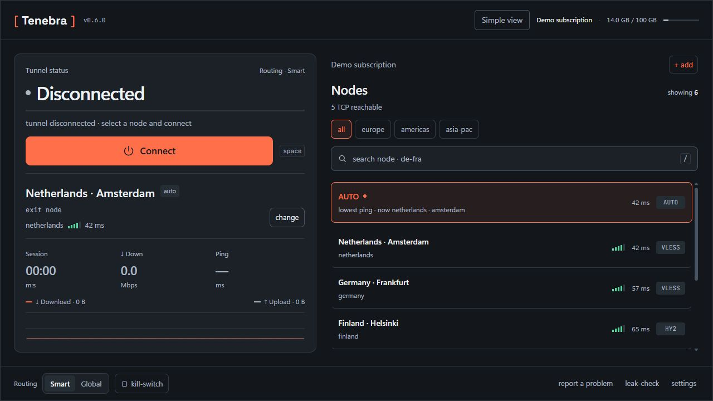
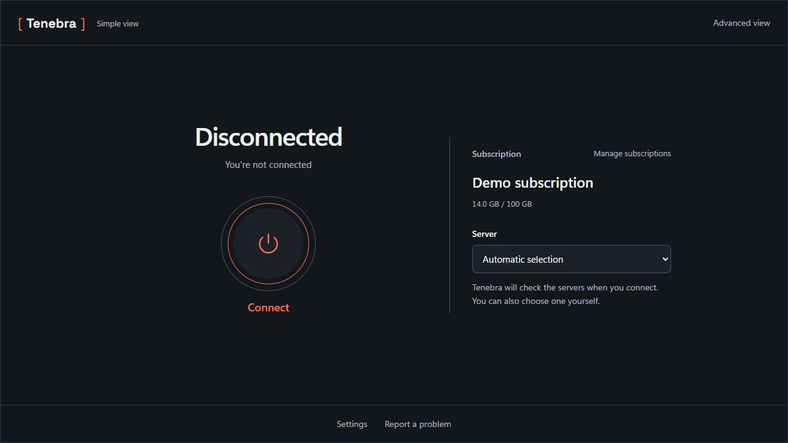

**A desktop VPN client built on [sing-box](https://github.com/SagerNet/sing-box).**

Bring your own subscription or compatible server link. Tenebra does not include VPN servers or require a Tenebra account.

**English** · [Русский](README.ru.md)

Windows x64 · [All packages](https://github.com/Divaaaan/tenebra/releases/latest) · [What's new in 0.6.0](CHANGELOG.md#060---2026-09-13)

| Platform | Before you install |
| --- | --- |
| **Windows** | Installer sets up the background service. The installer is not Authenticode-signed; SmartScreen may warn. |
| **macOS / Linux** | For advanced users: a privileged helper is required; setup varies by package. No native live-tunnel validation for 0.6.0. [Installation guide](docs/installation.md). |
| **Android / iOS** | Outside the 0.6.0 release. Android is experimental; iOS is a scaffold. |

## Two ways to use Tenebra

**Full mode** puts connection controls, servers, routing and diagnostics within reach.

*0.6.0 interface preview with demo data; not a live connection measurement.*

<strong>Simple mode</strong> — subscription, server and connection in one flow

*0.6.0 interface preview with demo data; not a live connection measurement.*

## Connect in three steps

1. **Install and open Tenebra.** On macOS and Linux, complete the [helper setup](docs/installation.md) first.
2. **Import your subscription or server link.** Paste a URL or share link, open a text file, or import a QR image. Obtain connection details from your provider or your own server.
3. **Select a server and connect.** Start with **Smart** routing for direct Russian/LAN destinations and a tunnel for other traffic; choose **Global** to route through the tunnel.

## What you get

- **Flexible imports.** VLESS/REALITY, Hysteria2, Shadowsocks, Trojan and VMess links; subscription lists, base64 and Clash/Mihomo YAML.
- **Routing controls.** Smart, Global and Direct modes, plus per-app include/exclude lists.
- **Connection fallback.** Tries the last working node first, then configured protocol alternatives when available.
- **Optional Windows DPI bypass.** Integrated zapret with an embedded bundle and controlled updates. Results depend on your network. [How it works](docs/dpi-bypass.md).
- **Useful diagnostics.** Public-IP observations, a best-effort DNS probe, logs and distinct service, engine and connection errors.
- **Desktop controls.** Tray actions, profiles, live traffic graphs, light/dark themes and Russian/English interfaces.

## Project status and known limits

**0.6.0 is an early desktop release.** Recorded Windows checks cover the nine-step installation sequence, both interfaces under an ordinary user at 100% and 150% display scaling, IPv4 tunnelling, system-proxy handling and selected crash/recovery cases. This is a limited acceptance scope; it does not establish compatibility with every subscription or network.

- **Windows protection:** the complete IPv6, BFE and reboot acceptance matrix remains open. A saved protection setting is separate from confirmed enforcement; do not read it as a universal leak-prevention guarantee. [Acceptance details](docs/host-protection-acceptance.md).
- **macOS and Linux:** packages are available, but native live-tunnel acceptance has not been completed. macOS is unsigned and unnotarized; Linux system-proxy mode is unsupported.
- **AmneziaWG:** links can be imported, but the bundled stock engine does not apply AWG obfuscation parameters; it uses plain WireGuard.
- **Diagnostics:** the IP/DNS check reports what it can observe; it does not certify all traffic paths.

## Documentation and support

[Installation](docs/installation.md) · [DPI bypass](docs/dpi-bypass.md) · [Documentation](docs/README.md) · [Changelog](CHANGELOG.md) · [Roadmap](ROADMAP.md)

For help, use [Discussions](https://github.com/Divaaaan/tenebra/discussions). Report bugs with your version, operating system and relevant logs through the [issue form](https://github.com/Divaaaan/tenebra/issues/new/choose). Remove subscription URLs, credentials and other private details before sharing logs. For security reports, follow [SECURITY.md](SECURITY.md).

To build or contribute, start with the [development guide](docs/development.md), [architecture](docs/architecture.md) and [CONTRIBUTING.md](CONTRIBUTING.md).

Tenebra is maintained in spare time; response times vary. Licensed under [GPLv3](LICENSE). Bundled components are listed in [Third-party notices](THIRD-PARTY-NOTICES.md).
