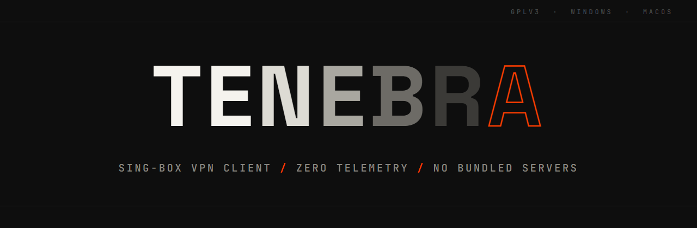

<div align="center">



[](https://github.com/Divaaaan/tenebra/actions/workflows/ci.yml)
[](https://www.gnu.org/licenses/gpl-3.0)
[](https://github.com/Divaaaan/tenebra/releases/latest)
[](#project-status)

**A cross-platform VPN client built on [sing-box](https://github.com/SagerNet/sing-box).**<br>
Desktop first — Windows is user-ready; macOS ships but is for advanced users (see below). A shared Go core is meant to extend to Linux, Android and iOS.



</div>

> **Project status — early development.** The desktop client is the current
> focus. The core, the control protocol and the UI are in good shape and well
> tested, but the real tunnel path (wintun + sing-box, which needs an elevated
> live run) is still being validated end to end. Treat this as pre-release:
> not yet "production-ready", and expect things to move around. See
> [Project status](#project-status) for the honest breakdown.

## Why another client

Most clients either lock you into a single protocol or are vague about what they
do with your traffic. Tenebra:

- speaks the protocols sing-box supports — VLESS/REALITY, Hysteria2, AmneziaWG,
  Shadowsocks, Trojan, VMess;
- routes Russian destinations directly and sends everything else through the
  tunnel, so latency-sensitive local traffic stays local;
- falls back between protocols when one gets throttled or blocked, and remembers
  what worked;
- ships no telemetry, no accounts and no bundled servers — you import your own
  subscription.

## What it does

Everything below is implemented in this repo today (the UI features are desktop):

- **Many protocols, one model.** Import VLESS (incl. REALITY), Hysteria2,
  AmneziaWG, Shadowsocks, Trojan and VMess. A single normalized node model feeds
  a from-scratch sing-box config generator. *(AmneziaWG links import and connect,
  but the bundled stock sing-box applies none of the AWG obfuscation parameters —
  the tunnel runs as plain WireGuard; full AmneziaWG obfuscation is on the
  [roadmap](ROADMAP.md).)*
- **Import the way you have it.** Subscription URL, a raw share link, a `.txt`
  file of links, clipboard paste, or a QR code (image file or pasted image).
  Subscription bodies handle a Clash/Mihomo YAML config, base64, or plaintext
  link lists and read the `Subscription-Userinfo` header for traffic used / total
  and expiry.
- **Smart RU routing.** *Smart* keeps Russian domains and IPs (and your LAN)
  direct and tunnels the rest; *Global* tunnels everything; *Direct* is the
  proxy off. Geodata is pulled from the official public sing-geoip / sing-geosite
  rule-sets at runtime — the client ships none of its own.
- **Protocol fallback.** A pure state machine walks the last known-good node
  first, then by protocol preference (REALITY → Hysteria2 → AmneziaWG), so a
  blocked or throttled protocol is retried as another. The last good node leads
  the next launch.
- **Per-app split tunnelling.** *Exclude* sends chosen apps around the tunnel;
  *Include* sends only chosen apps through it. Matched by executable name and
  persisted across restarts.
- **Honest leak check.** Observes the machine's public IP from redundant echo
  services and runs a best-effort DNS probe, then reports a verdict that never
  fakes a pass — it tells you what it could *not* measure rather than claiming
  "safe". See [docs/control-protocol.md](docs/control-protocol.md#leak-check-leak_check).
- **Desktop niceties.** System tray that reflects the connection state (with quick
  connect/disconnect), desktop notifications on state changes, `tenebra://` deep
  links (import a subscription or connect a profile), launch at login (optionally
  minimized to the tray), single-instance, live traffic graphs, light/dark themes,
  and English / Russian UI.

The kill-switch (drop proxied traffic instead of leaking when the tunnel drops) is a
UI toggle — best-effort by design, with the exact guarantee described in the
[changelog](CHANGELOG.md); LAN bypass is a core routing option.

## Installing

**Windows** — from the [Windows Package Manager](https://learn.microsoft.com/windows/package-manager/winget/):

```powershell
winget install Divaaaan.Tenebra
```

or grab `Tenebra_x.y.z_x64-setup.exe` from the
[latest release](https://github.com/Divaaaan/tenebra/releases/latest). Either
way the installer sets up the background service and the in-app updater keeps
everything current.

**macOS** — download the universal DMG from the
[latest release](https://github.com/Divaaaan/tenebra/releases/latest), then
read the [macOS note](#macos-note--read-before-downloading-the-dmg) first —
the build currently needs a hand-installed root daemon.

## Getting a server

Tenebra is a **client** — it ships no servers and hard-codes nothing. You bring
your own endpoint and import it as a subscription or a share link. Two ways to
get one:

- **Run your own.** Any [sing-box](https://github.com/SagerNet/sing-box) or Xray
  server works; point Tenebra at its subscription URL.
- **Use a provider.** Any service that hands you a subscription or a share link
  will do. I run one at **[vpsxd.pro](https://vpsxd.pro)**.

## Project status

| Area | State |
|------|-------|
| Go core (parsing, profiles, routing, config gen, fallback, leak logic) | Implemented, unit-tested, no third-party deps |
| Control protocol (core ↔ UI) | Implemented; covered by Go tests **and** a real-binary e2e |
| Desktop UI (Tauri 2 + React) | Implemented: all screens, reactive tray, notifications, deep links, autostart, i18n, themes |
| Windows tunnel (wintun + sing-box) | Implemented — a background **service** runs the tunnel, so the app connects without an elevated GUI; installer sets it up, the in-app updater refreshes both app and service |
| macOS tunnel (utun + sing-box) | Builds and runs — universal `.app`/DMG — but see the **macOS note** below: it needs a hand-installed root daemon and is not yet a click-to-run product |
| Linux / Android / iOS | Planned — the core is shared and platform-agnostic |
| Release pipeline | Tag-triggered `release` workflow builds the Windows and macOS bundles, minisign-signs the in-app updater artifacts, and publishes a GitHub release |
| Code-signing | Not set up — the Windows installer is Authenticode-unsigned (SmartScreen warns) and the macOS build is unsigned/un-notarized (Gatekeeper needs a manual "Open Anyway") |

### macOS note — read before downloading the DMG

The macOS build is **for advanced users right now, not a finished product.** Two
things are not yet in place, so a plain "download the DMG and drag to
Applications" will **not** give you a working tunnel:

- **The tunnel needs a privileged helper.** macOS only lets root open the `utun`
  device, so the app talks to a small root **LaunchDaemon** that owns the tunnel.
  That daemon is currently installed **by hand** with a `sudo` script
  ([`scripts/macos/install-daemon.sh`](scripts/macos/install-daemon.sh)) — there
  is no in-app installer for it yet. Without it, the app runs but cannot connect.
- **The build is unsigned and un-notarized.** First launch needs
  **System Settings → Privacy & Security → Open Anyway**, and updates to the
  daemon are a manual step (the in-app updater refreshes only the app, not the
  root daemon). Since 0.4.4 the app warns with a banner when the daemon has
  fallen behind it; re-run the install script from your checkout to update:
  `sudo bash scripts/macos/install-daemon.sh --from-app /Applications/Tenebra.app --allow-unsigned`.

The click-to-run macOS path — a signed, notarized build with an `SMAppService`
daemon bundled inside the app (so it installs and updates like the Windows
service) — needs an Apple Developer ID and is **planned, not done**. Until then,
use the DMG only if you're comfortable running the install script yourself.
**Windows users are unaffected** — the Windows installer sets up the service and
the updater keeps everything current automatically.

If you want to help close the gap, the macOS `SMAppService` path and the
non-desktop adapters are the highest-leverage places — see
[CONTRIBUTING.md](CONTRIBUTING.md).

## Repository layout

```
tenebra/
├── core/                 Go. Platform-agnostic, stdlib-only, fully unit-tested.
│   ├── model/            Normalized proxy node + config types.
│   ├── subscription/     Parse vless/hysteria2/ss/trojan/vmess links + sub bodies.
│   ├── profile/          Named profiles and their atomic on-disk store.
│   ├── routing/          smart/global/direct + per-app split -> sing-box route/dns.
│   ├── singbox/          Build a full sing-box config as plain JSON (no sing-box dep).
│   ├── fallback/         Pure REALITY->Hysteria2->AmneziaWG fallback state machine.
│   └── control/          The line-delimited JSON protocol + the daemon.
├── adapters/
│   └── windows/          Spawn & supervise sing-box; traffic via its clash API.
├── cmd/
│   └── tenebra-core/     The sidecar entry point (talks the protocol on stdin/stdout).
├── ui-desktop/           Tauri 2 app: Rust shell (src-tauri) + React/TS front end (src).
├── scripts/
│   └── fetch-resources.ps1   Download pinned sing-box + wintun for bundling.
└── docs/                 Architecture, control protocol, and the dev guide.
```

## Building

Requirements: **Go 1.24+**, **Node 22+**, and the **Rust toolchain** (for the
desktop UI). Full walkthrough and troubleshooting in
[docs/development.md](docs/development.md).

Core tests:

```
go test ./...
```

Desktop app (Windows):

```
# fetch the sing-box binary and wintun.dll into src-tauri/resources
powershell -File scripts/fetch-resources.ps1

# build the core sidecar where Tauri bundles it
go build -o ui-desktop/src-tauri/binaries/tenebra-core-x86_64-pc-windows-msvc.exe ./cmd/tenebra-core

# build the bundle
cd ui-desktop
npm install
npm run tauri build
```

## Documentation

- [docs/](docs/) — documentation index.
- [docs/architecture.md](docs/architecture.md) — the layers and how they connect.
- [docs/control-protocol.md](docs/control-protocol.md) — the core ↔ UI wire format.
- [docs/development.md](docs/development.md) — set up, build, run and test.
- [CONTRIBUTING.md](CONTRIBUTING.md) — how to contribute.
- [SECURITY.md](SECURITY.md) — reporting a vulnerability and our trust stance.
- [CHANGELOG.md](CHANGELOG.md) — what's changed.
- [ROADMAP.md](ROADMAP.md) — where the project is headed.

## Support

Tenebra is maintained by one person in their spare time, so please keep support
low-friction:

- **Questions or help** — start a thread in
  [Discussions](https://github.com/Divaaaan/tenebra/discussions).
- **Bugs** — file a report through the
  [issue form](https://github.com/Divaaaan/tenebra/issues/new/choose); it asks
  for your version, Windows build and logs.
- **Security problems** — follow [SECURITY.md](SECURITY.md); please don't open a
  public issue.

Response times vary — this is a side project, not a supported product. Thanks for
your patience.

## License

GPLv3 — see [LICENSE](LICENSE). sing-box is GPLv3, so Tenebra is too. Bundled
third-party components and their licenses are listed in
[THIRD-PARTY-NOTICES.md](THIRD-PARTY-NOTICES.md).
